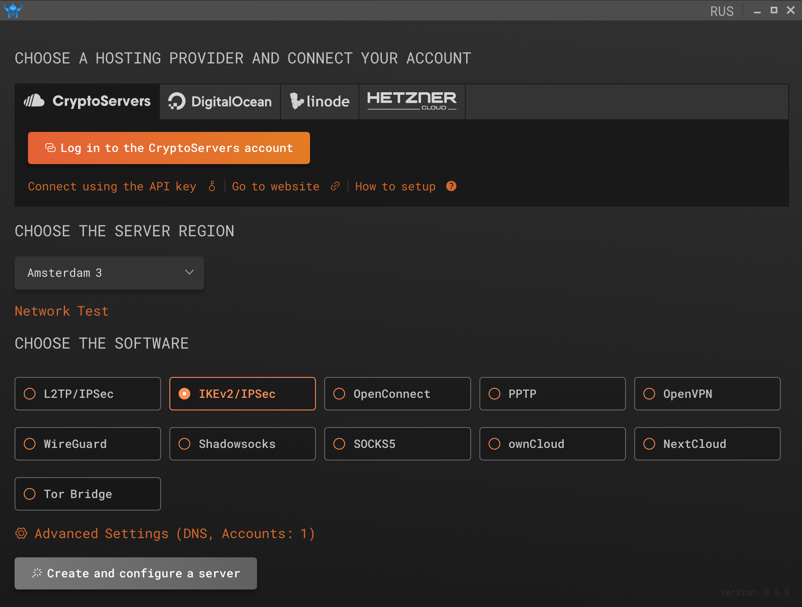

# MyVPN - The best solution for a personal VPN server!

Open source desktop application for the personal VPN server.



### Stack

* ElectronJS
* VueJS
* [ElementUI](https://element.eleme.io/)
* [MyVPN Agent](https://github.com/my0419/myvpn-agent)

### Providers

* [CryptoServers](https://cryptoservers.net/)
* [DigitalOcean](https://www.digitalocean.com/)
* [Linode](https://linode.com/)


### VPN protocols

* L2TP
* PPTP
* OpenVPN
* [WireGuard](https://www.wireguard.com/)

### Languages

* English
* Russian

### Build Setup

``` bash
# install dependencies
npm install

# serve with hot reload
npm run dev

```

### Build for platform

#### Windows x64 (.exe)

``` bash
npm run build:windows
```

#### Linux Debian / Ubuntu (.deb) and Other (.tar.bz2)

``` bash
npm run build:linux
```

#### MacOS (.dmg)

``` bash
npm run build:mac
```

### Official Website

[www.myvpn.run](http://myvpn.run)
